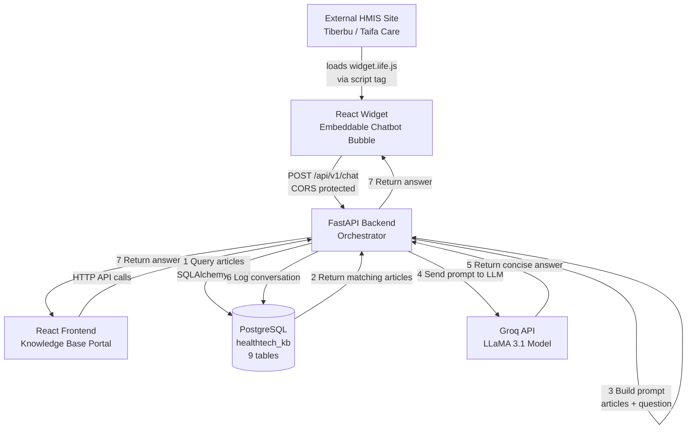
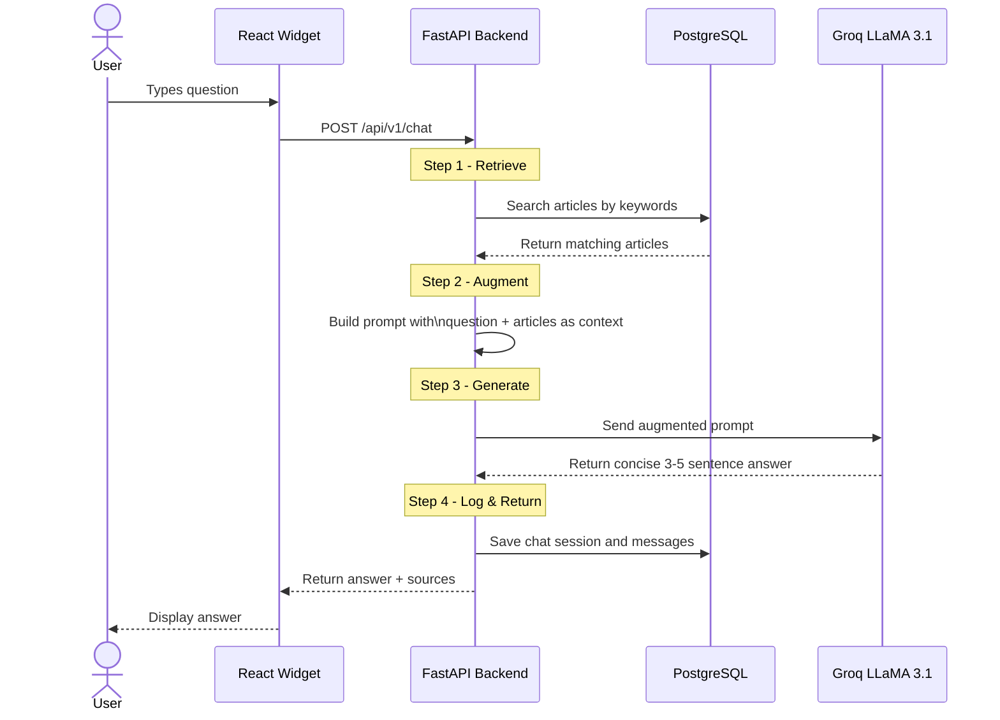
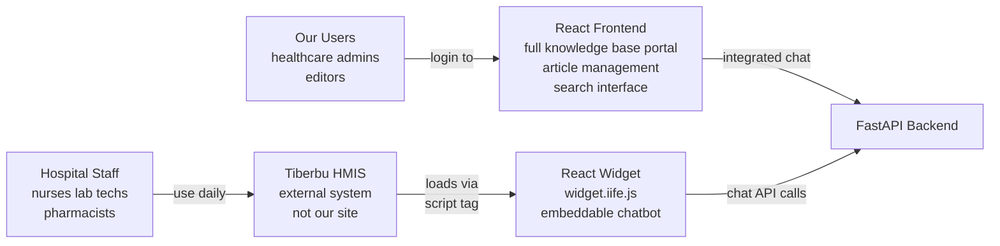
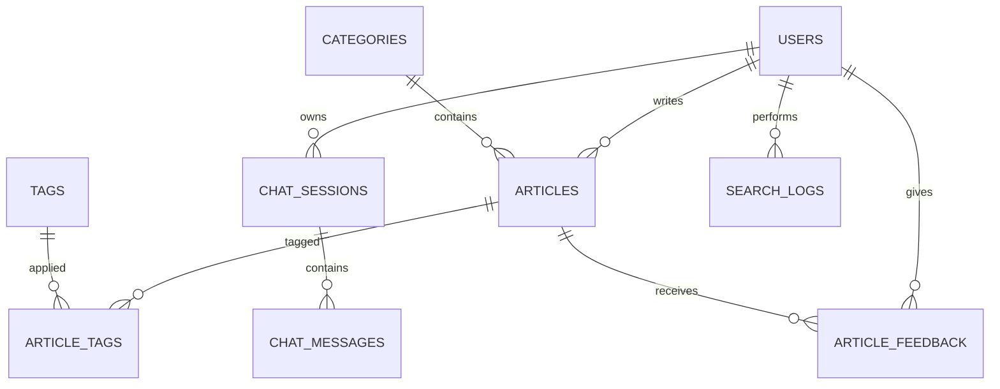

 Healthtech KB & HMIS Chatbot — Architecture

 System Architecture

 How the RAG Pipeline Works

The FastAPI backend is the orchestrator — it controls everything:

 Why Widget and Frontend are Separate

 Database Schema

