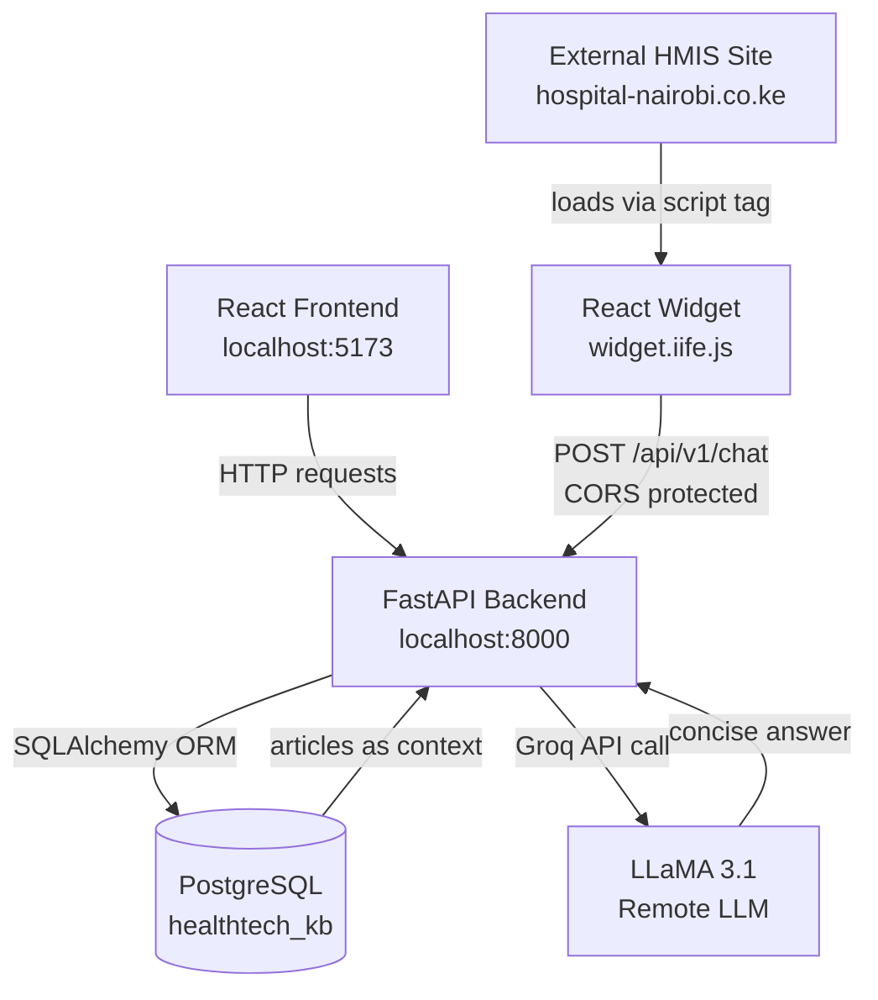
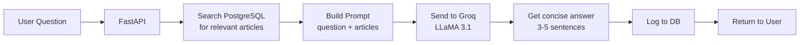
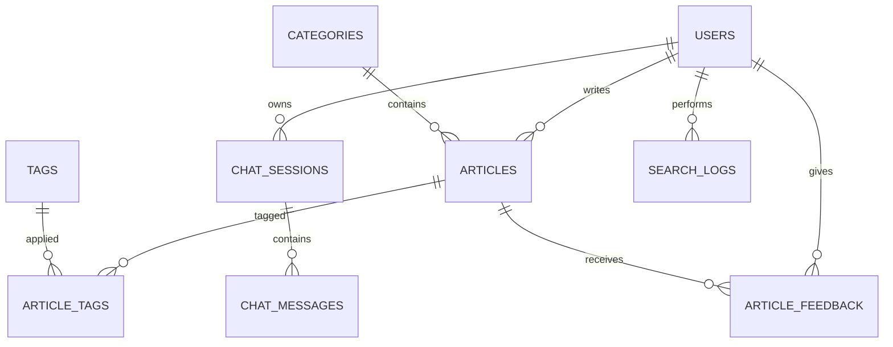

 Healthtech KB & HMIS Chatbot — Architecture

 System Architecture

```mermaid
graph TD
    A[External HMIS Site\nhospital-nairobi.co.ke] -->|loads via script tag| B[React Widget\nwidget.iife.js]
    C[React Frontend\nlocalhost:5173] -->|HTTP requests| D[FastAPI Backend\nlocalhost:8000]
    B -->|POST /api/v1/chat\nCORS protected| D
    D -->|SQLAlchemy ORM| E[(PostgreSQL\nhealthtech_kb)]
    D -->|Groq API call| F[LLaMA 3.1\nRemote LLM]
    F -->|concise answer| D
    E -->|articles as context| D
```

 RAG Pipeline

```mermaid
graph LR
    A[User Question] --> B[FastAPI]
    B --> C[Search PostgreSQL\nfor relevant articles]
    C --> D[Build Prompt\nquestion + articles]
    D --> E[Send to Groq\nLLaMA 3.1]
    E --> F[Get concise answer\n3-5 sentences]
    F --> G[Log to DB]
    G --> H[Return to User]
```

 Database Schema

```mermaid
erDiagram
    USERS ||--o{ ARTICLES : writes
    USERS ||--o{ CHAT_SESSIONS : owns
    USERS ||--o{ ARTICLE_FEEDBACK : gives
    CATEGORIES ||--o{ ARTICLES : contains
    ARTICLES ||--o{ ARTICLE_TAGS : tagged
    TAGS ||--o{ ARTICLE_TAGS : applied
    ARTICLES ||--o{ ARTICLE_FEEDBACK : receives
    CHAT_SESSIONS ||--o{ CHAT_MESSAGES : contains
    USERS ||--o{ SEARCH_LOGS : performs
```