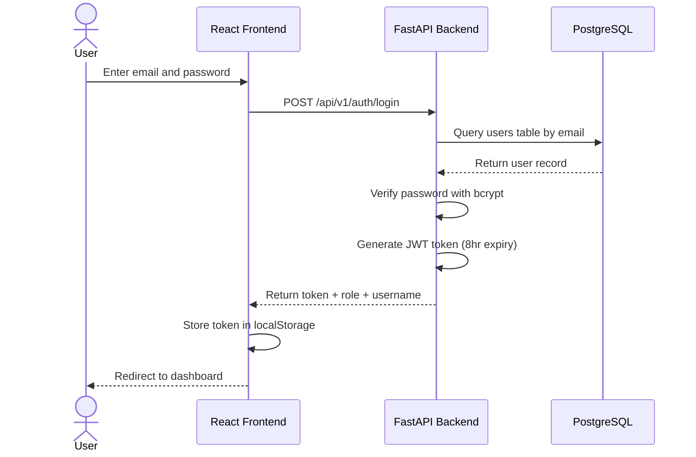
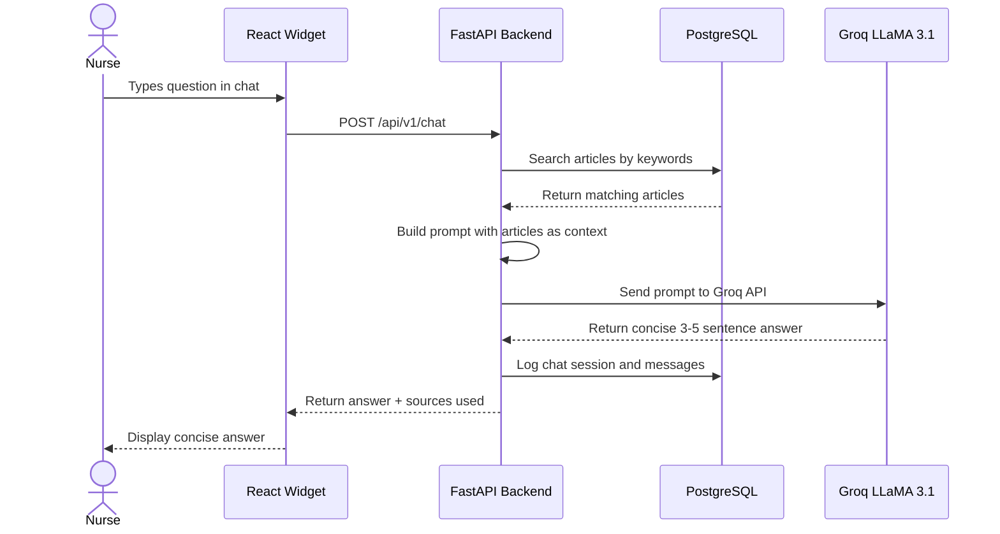
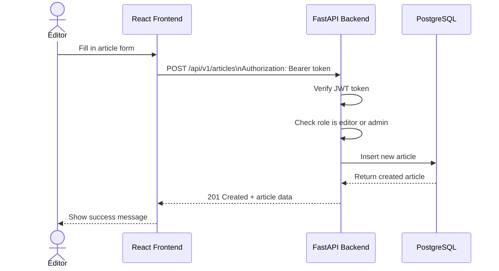

 Sequence Diagrams — Healthtech KB & HMIS Chatbot

 1. User Login Flow

```mermaid
sequenceDiagram
    actor User
    participant Frontend as React Frontend
    participant API as FastAPI Backend
    participant DB as PostgreSQL

    User->>Frontend: Enter email and password
    Frontend->>API: POST /api/v1/auth/login
    API->>DB: Query users table by email
    DB-->>API: Return user record
    API->>API: Verify password with bcrypt
    API->>API: Generate JWT token (8hr expiry)
    API-->>Frontend: Return token + role + username
    Frontend->>Frontend: Store token in localStorage
    Frontend-->>User: Redirect to dashboard
```

 2. Chatbot RAG Flow

```mermaid
sequenceDiagram
    actor Nurse
    participant Widget as React Widget
    participant API as FastAPI Backend
    participant DB as PostgreSQL
    participant LLM as Groq LLaMA 3.1

    Nurse->>Widget: Types question in chat
    Widget->>API: POST /api/v1/chat
    API->>DB: Search articles by keywords
    DB-->>API: Return matching articles
    API->>API: Build prompt with articles as context
    API->>LLM: Send prompt to Groq API
    LLM-->>API: Return concise 3-5 sentence answer
    API->>DB: Log chat session and messages
    API-->>Widget: Return answer + sources used
    Widget-->>Nurse: Display concise answer
```

 3. Article CRUD Flow (Editor)

```mermaid
sequenceDiagram
    actor Editor
    participant Frontend as React Frontend
    participant API as FastAPI Backend
    participant DB as PostgreSQL

    Editor->>Frontend: Fill in article form
    Frontend->>API: POST /api/v1/articles\nAuthorization: Bearer token
    API->>API: Verify JWT token
    API->>API: Check role is editor or admin
    API->>DB: Insert new article
    DB-->>API: Return created article
    API-->>Frontend: 201 Created + article data
    Frontend-->>Editor: Show success message
```